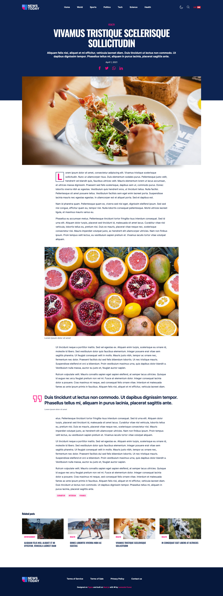

# News Today — Nuxt Blog Concept

> News concept website built with Nuxt 2 + Vue 2 using WordPress as a headless CMS.

**Live demo:** https://news-today-nuxt.netlify.app/  
**Backend (WordPress REST API):** https://dev-today-news.pantheonsite.io  
Designed on Figma and built with Nuxt.js by [Leonardo Funez](https://leofunez.dev).

## Badges


## Features

- Home with hero, grid, Trending (Top 9) and More Top Stories sections
- Category, tag, search, post (`_slug`) and page (`_slug`) routes with `_embed` relations
- Header/footer WordPress menus, related posts, dark-mode toggle, search form
- Static generation (`target: static`, `fallback: 404.html`) + Netlify `_redirects` proxy for `/wp-json/*`
- SCSS design system (`Inter` + `Oswald`, custom colors/mixins) + Jest + Vue Test Utils setup

## Frameworks

| Framework / Module | Version (range → resolved) | Where it's wired |
| --- | --- | --- |
| `nuxt` | `^2.15.3` → `2.15.6` | `package.json`, `nuxt.config.js` (`target: static`, `components: true`) |
| `vue` | `2.7.16` (via Nuxt) | `vue-server-renderer 2.7.16`, `jest.moduleNameMapper: vue/dist/vue.common.js` |
| `vue-server-renderer` | `^2.7.16` → `2.7.16` | SSR renderer for Nuxt 2 + Vue 2 |
| `@nuxtjs/composition-api` | `^0.24.4` → `0.24.4` | `buildModules` |
| `@nuxtjs/proxy` | `^2.1.0` → `2.1.0` | `buildModules`, `proxy: { '/wp-json': ... }` |
| `@nuxtjs/axios` | `^5.13.6` → `5.13.6` | `modules`, `axios: { proxy: true, baseURL: '/' }` |

## Dependencies

| Package | Version (range → resolved) | Purpose |
| --- | --- | --- |
| `@nuxtjs/axios` | `^5.13.6` → `5.13.6` | Nuxt Axios module (`proxy: true`, `baseURL: '/'`) |
| `@nuxtjs/composition-api` | `^0.24.4` → `0.24.4` | Composition API support for Nuxt 2 |
| `@nuxtjs/proxy` | `^2.1.0` → `2.1.0` | Dev/proxy `/wp-json` → Pantheon, `changeOrigin: true` |
| `axios` | `^0.21.1` → `0.21.1` | HTTP client used in `api/api.js` (`baseURL: '/wp-json/wp/v2/'`) |
| `core-js` | `^3.9.1` → `3.13.1` | Polyfills for Nuxt build |
| `nuxt` | `^2.15.3` → `2.15.6` | Framework, SSR/static generation, routing |
| `vue-server-renderer` | `^2.7.16` → `2.7.16` | Vue 2 server rendering |

### Dev Dependencies

| Package | Version (range → resolved) | Purpose |
| --- | --- | --- |
| `@vue/test-utils` | `^1.1.3` → `1.2.0` | Component tests (Vue 2) |
| `babel-core` | `7.0.0-bridge.0` | Babel bridge for Jest |
| `babel-jest` | `^26.6.3` → `26.6.3` | Transform `*.js` in Jest |
| `jest` | `^26.6.3` → `26.6.3` | Test runner (`yarn test` / `npm test`) |
| `sass` | `^1.103.1` → `1.103.1` | SCSS compiler (`sassOptions.silenceDeprecations`) |
| `sass-loader` | `10.1.1` | Webpack SCSS loader for Nuxt build |
| `vue-jest` | `^3.0.4` → `3.0.7` | Transform `*.vue` in Jest |

> Resolved versions from `package-lock.json` (`lockfileVersion: 3`).

## Prerequisites

| Requirement | Value |
| --- | --- |
| Node | `20` per `.nvmrc` / `.node-version` (`package.json engines: >=22.0.0`) |
| Package manager | `npm` (`package-lock.json` committed) or `yarn` |
| Backend | Public Pantheon WordPress at `MAIN_URL` below — no key required |

## Build Setup

```bash
# install dependencies
npm install
# or
yarn install

# serve with hot reload at localhost:4000
npm run dev
# or
yarn dev

# build for production and launch server
npm run build
npm run start

# generate static project (OpenSSL legacy provider required on Node 17+)
npm run generate

# run tests
npm test
```

| Script | Command | Notes |
| --- | --- | --- |
| `dev` | `nuxt --port 4000` | Hot reload, proxied `/wp-json` |
| `build` | `nuxt build` | Production SSR bundle |
| `start` | `nuxt start` | Serve production build |
| `generate` | `NODE_OPTIONS=--openssl-legacy-provider nuxt generate` | Static output to `dist/` + `404.html` fallback |
| `test` | `jest` | Coverage from `components/**/*.vue`, `pages/**/*.vue` |

## Configuration

| Key | Value | File |
| --- | --- | --- |
| `APP_TITLE` / `SITE_URL` | `News Today` / `https://news-today-nuxt.netlify.app` | `constants/index.js`, `nuxt.config.js head/og:url` |
| `MAIN_URL` | `https://dev-today-news.pantheonsite.io` | `constants/index.js`, `nuxt.config.js proxy.target` |
| Axios | `{ proxy: true, baseURL: '/' }` + `axios.create({ baseURL: '/wp-json/wp/v2/' })` | `nuxt.config.js`, `api/api.js` |
| Proxy | `'/wp-json': { target, pathRewrite: { '^/wp-json': '/wp-json' }, changeOrigin: true }` | `nuxt.config.js` |
| Netlify proxy | `/wp-json/*  https://dev-today-news.pantheonsite.io/wp-json/:splat  200` | `static/_redirects` |
| Target | `static`, `generate.fallback: '404.html'` | `nuxt.config.js` |
| Global CSS / Fonts | `~/assets/css/normalize.css`, `Inter + Oswald` via Google Fonts | `nuxt.config.js` |
| Auto-import | `components: true`, `plugins: []` | `nuxt.config.js` |

## WordPress API used (`api/api.js`)

Base: `/wp-json/wp/v2/` (proxied to Pantheon).

| Method | Endpoint | Params |
| --- | --- | --- |
| `getHeaderMenu` | `GET menu-header` | — |
| `getFooterMenu` | `GET menu-footer` | — |
| `getHomePosts` | `GET posts` | `per_page=43, _embed=true` |
| `getTendingPosts` | `GET posts` | `per_page=9, _embed=true` |
| `getCategoryInfo` | `GET categories` | `slug` |
| `getCategoryById` | `GET categories/:id` | — |
| `getCategoryPosts` | `GET posts` | `categories=id, per_page, _embed=true` |
| `getTagInfo` | `GET tags` | `slug` |
| `getTagInfoById` | `GET tags/:id` | — |
| `getTagPosts` | `GET posts` | `tag=id, per_page, _embed=true` |
| `getPost` | `GET posts` | `slug, _embed=true` |
| `getPage` | `GET pages` | `slug, _embed=true` |
| `getSearchPosts` | `GET posts` | `search=query, per_page=10, _embed=true` |

## Routes

| Route file | Path | Data |
| --- | --- | --- |
| `pages/index.vue` | `/` | Home + trending posts |
| `pages/_category/index.vue` | `/:category` | Category info + posts |
| `pages/_category/_slug.vue` | `/:category/:slug` | Single post + related |
| `pages/page/_slug.vue` | `/page/:slug` | Single WP page |
| `pages/search/index.vue` | `/search?q=` | Search results |
| `pages/tag/_slug/index.vue` | `/tag/:slug` | Tag info + posts |
| `layouts/default.vue`, `error.vue` | — | Header/Footer shell, error page |

## File Structure

```text
.
├── api/
│   └── api.js                  # Axios WordPress client (menus, posts, categories, tags, pages, search)
├── assets/
│   ├── css/normalize.css
│   ├── scss/main.scss  _colors.scss  _mixins.scss
│   └── images/ (*.svg, banner.jpg, promo.jpg, favicons/, social/)
├── components/
│   ├── Header.vue  Footer.vue  Menu.vue  SearchForm.vue
│   ├── PostCard.vue  RelatedPosts.vue  SectionTitle.vue  PostCount.vue
│   ├── Button.vue  Loader.vue  LoaderString.vue  DarkModeTrigger.vue
│   └── icons/Facebook.vue  Twitter.vue  Whatsapp.vue  Linkedin.vue  SearchIcon.vue
├── constants/index.js          # SITE_URL, MAIN_URL, APP_TITLE, COLORS
├── docs/
│   └── screenshots/homepage.png  article.png  # README images (this PR)
├── layouts/default.vue  error.vue
├── middleware/                 # empty (README placeholder)
├── pages/index.vue  _category/index.vue  _category/_slug.vue
│        page/_slug.vue  search/index.vue  tag/_slug/index.vue
├── plugins/                    # empty (README placeholder)
├── static/_redirects  favicon.ico  favicons/
├── store/index.js
├── test/Logo.spec.js
├── utils/is-mobile.js
├── nuxt.config.js              # head/meta, static target, axios/proxy, sass, fonts
├── jest.config.js              # @/~ alias, vue-jest + babel-jest, coverage
├── .nvmrc / .node-version      # 20
├── package.json / package-lock.json
└── README.md
```

## Deployment

- Static hosting on Netlify (`SITE_URL`, `og:url`).
- `nuxt.config.js`: `target: 'static'`, `generate.fallback: '404.html'` → `dist/` committed in repo.
- `static/_redirects` proxies `/wp-json/*` to Pantheon with `200` so the static frontend keeps calling same-origin `/wp-json/wp/v2/`.
- No `netlify.toml` at root; default `nuxt generate` output is published.

## Testing

- `jest.config.js`: aliases `^@/(.*)` / `^~/(.*)` → `<rootDir>/$1`, `^vue$` → `vue/dist/vue.common.js`; transforms `*.js` via `babel-jest`, `*.vue` via `vue-jest`; `collectCoverage: true` for `components/**/*.vue`, `pages/**/*.vue`.
- Run: `npm test` / `yarn test`.
- Note: `test/Logo.spec.js` mounts `@/components/Logo.vue`, which does not exist in `components/` — update or remove before relying on CI.

For detailed explanation on how things work, check out [Nuxt.js docs](https://nuxtjs.org).

## Screenshots

### Homepage — hero, grid, Trending and More Top Stories


### Article page — cover, body, quote and related posts


